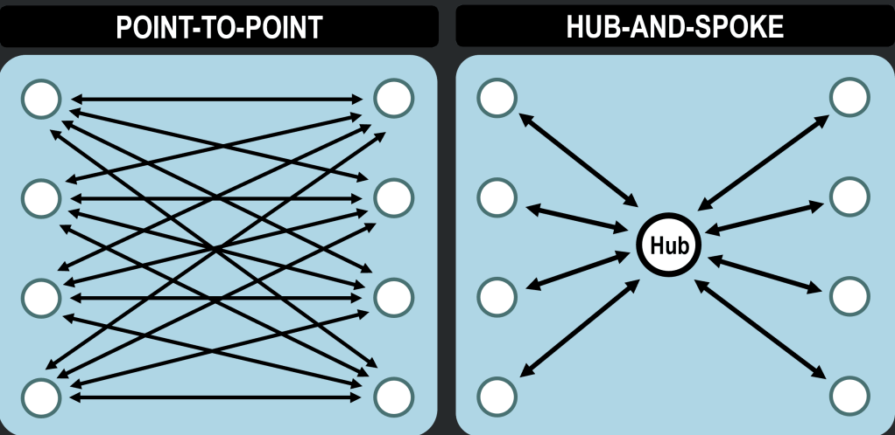

# Creating a Virtual Machine

## Objective:
Understand how to create and use virtual machines in Azure.

## What is Networking?
Networking in the context of cloud computing involves connecting different resources, such as virtual machines, storage, and applications, so they can communicate with each other. Networking in Azure allows you to create and manage your own virtual networks, set up secure connections, and control traffic flow to enhance security and performance.

### Key Networking Concepts:
- **Virtual Network (VNet):** A representation of your own network in the cloud. It enables many types of Azure resources, such as Azure Virtual Machines (VM), to securely communicate with each other, the internet, and on-premises networks.
- **Subnets:** Segments within a VNet that help organize and secure resources. Each subnet can contain multiple resources like VMs.
- **Network Security Groups (NSGs):** Used to control inbound and outbound traffic to network interfaces (NIC), VMs, and subnets.
- **Virtual Private Network (VPN):** A way to securely connect your on-premises network to your Azure VNet.

## What is a Hub and Spoke Network?
A Hub and Spoke network topology is a common network architecture where the hub acts as a central point of connectivity and control. The spokes are individual VNets that connect to the hub, but not to each other. This setup helps manage and secure network traffic effectively.

### Hub and Spoke Network Components:
- **Hub Network:** The central VNet that typically contains shared resources and services like a VPN gateway or Azure Bastion.
- **Spoke Network:** VNets that are connected to the hub VNet via peering. These contain resources like VMs that need to communicate with the hub.

### Benefits of a Hub and Spoke Network:
- **Centralized Management:** Easier to manage and control network traffic from a central point.
- **Isolation:** Spokes are isolated from each other, which enhances security.
- **Scalability:** Simplifies adding new spokes without major reconfiguration.

### Example Scenario:
- **Hub VNet:** Contains shared resources like an Azure Bastion for secure remote access and a VPN gateway for connectivity to on-premises networks.
- **Spoke VNet:** Contains application VMs, databases, or other resources that need to communicate with services in the hub.

## Steps:

### Step 1: Create a Hub and Spoke Network

1. **Open the Azure portal and navigate to "Resource Groups".**
   - Click on "Create a Resource Group".
   - **Name:** Use the Azure abbreviations naming convention, e.g., `rg-hub-spoke-yourinitials` (replace `yourinitials` with your own initials).
   - **Region:** Select "UK South".
   - Click "Review + Create" and then "Create".

2. **Create a Virtual Network for the Hub:**
   - Navigate to "Virtual Networks".
   - Click on "Create" and choose "Virtual Network".
   - **Name:** Use a name like `vnet-hub-yourinitials`.
   - **Resource Group:** Select the resource group `rg-hub-spoke-yourinitials`.
   - **Region:** Select "UK South".
   - **Address space:** Use an address space like `10.0.0.0/16`.
   - Click "Review + Create" and then "Create".

3. **Create a Virtual Network for the Spoke:**
   - Navigate to "Virtual Networks".
   - Click on "Create" and choose "Virtual Network".
   - **Name:** Use a name like `vnet-spoke-yourinitials`.
   - **Resource Group:** Select the resource group `rg-hub-spoke-yourinitials`.
   - **Region:** Select "UK South".
   - **Address space:** Use an address space like `10.1.0.0/16`.
   - Click "Review + Create" and then "Create".

4. **Create a Peering Connection between Hub and Spoke:**
   - Navigate to "Virtual Networks" and select `vnet-hub-yourinitials`.
   - Under "Settings," select "Peerings" and click "+ Add".
   - **Peering Link Name:** Use `hub-to-spoke`.
   - **Virtual Network:** Select `vnet-spoke-yourinitials`.
   - Enable "Allow Virtual Network Access" and "Allow Forwarded Traffic".
   - Click "Add".

   - Repeat the process for `vnet-spoke-yourinitials` to peer with `vnet-hub-yourinitials`.

### Step 2: Create a Virtual Machine in the Spoke

1. **Navigate to "Virtual Machines" in the Azure portal.**
   - Click on "Create" and choose "Virtual Machine".

2. **Fill in the details:**
   - **Name:** Choose a name for your VM.
   - **Resource Group:** Select the resource group `rg-hub-spoke-yourinitials`.
   - **Region:** Select "UK South".
   - **Image:** Choose an operating system (e.g., Windows Server, Ubuntu).
   - **Size:** Select a VM size (Standard_B1s for this exercise).
   - **Virtual Network:** Select `vnet-spoke-yourinitials`.
   - **Subnet:** Use the default subnet.
   - **Public IP:** None (since we will use Bastion for access).
   - **Network Security Group:** Basic.
   - **Authentication:** Set up authentication (password or SSH key).

3. **Review and create the VM:**
   - Click "Review + Create" and then "Create".
   - Wait for the deployment to complete.

### Step 3: Create an Azure Bastion in the Hub

1. **Navigate to "Bastions" in the Azure portal.**
   - Click on "Create Bastion".

2. **Fill in the details:**
   - **Name:** Use a name like `bastion-hub-yourinitials`.
   - **Resource Group:** Select the resource group `rg-hub-spoke-yourinitials`.
   - **Virtual Network:** Select `vnet-hub-yourinitials`.
   - **Subnet:** Create a new subnet named `AzureBastionSubnet` with the address range `10.0.1.0/24`.
   - **Public IP Address:** Create a new public IP address named `bastion-ip-yourinitials`.
   - Click "Review + Create" and then "Create".

### Step 4: Connect to the VM using Bastion

1. **Navigate to "Virtual Machines" and select the VM created in the spoke network.**
   - Under "Operations," select "Bastion" and click "Use Bastion".

2. **Connect to the VM:**
   - Enter the username and password you configured for the VM.
   - Click "Connect" to access the VM using Bastion.

## Exploration:
Take a few minutes to navigate through the Azure portal. Familiarize yourself with the dashboard, menus, and available services.

## Helpful Resources:
- [Azure Bastion Documentation](https://docs.microsoft.com/en-us/azure/bastion/bastion-overview)
- [Quickstart: Create a Linux VM in the Azure portal](https://docs.microsoft.com/en-us/azure/virtual-machines/linux/quick-create-portal)
- [Quickstart: Create a Windows VM in the Azure portal](https://docs.microsoft.com/en-us/azure/virtual-machines/windows/quick-create-portal)
- [Azure Virtual Machines Documentation](https://docs.microsoft.com/en-us/azure/virtual-machines/)
